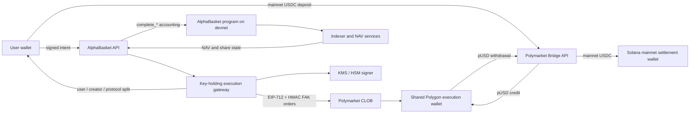

# AlphaBasket

AlphaBasket is a real-position Polymarket basket protocol with share accounting
on Solana.

The current V2 architecture deliberately separates accounting from capital:

- The AlphaBasket program runs on **Solana devnet** during internal testing.
- User USDC deposits and withdrawal payouts use **Solana mainnet-beta**.
- Trading and position custody use **Polymarket on Polygon mainnet**.
- The Solana program records baskets, shares, fees, lifecycle state and
  immutable settlement receipts. It does **not** custody USDC or pUSD.

Configured devnet program ID:
`5mzLoAijdzAQV5D7QXe6TTGZ9TkWQanygfnb5VPPxFSm`.

## Current architecture



### Deposit flow

1. The API creates a short-lived deposit quote and the user signs the exact
   intent.
2. The user submits one Solana-mainnet transaction containing:
   - the net USDC amount to the Polymarket bridge address; and
   - the 0.5% deposit fee to the protocol destination.
3. The backend verifies both finalized mainnet token-account deltas.
4. The Bridge API converts the net deposit to pUSD in the assigned Polygon
   execution wallet.
5. The execution worker submits FAK buys. Partial fills are accepted and any
   unspent pUSD remains attributed to the basket as idle pUSD.
6. The backend reloads a fresh off-chain NAV and submits `complete_deposit` to
   the Solana-devnet program.
7. The program verifies the user intent, backend authority, execution
   attestation, limits and accounting math before minting internal shares.

### Withdrawal flow

1. The user signs a withdrawal intent for a specific share amount and minimum
   output.
2. The backend liquidates the basket exposure pro rata using FAK sells and
   includes the redeemed share of idle pUSD.
3. Realized pUSD is transferred to a Bridge API withdrawal address targeting
   the configured Solana-mainnet settlement wallet.
4. The backend verifies the finalized mainnet USDC receipt.
5. The execution gateway atomically distributes mainnet USDC to the user,
   creator and protocol.
6. Only after those effects are verified does the backend submit
   `complete_withdrawal` to the Solana-devnet program.

The same split applies to protocol management-share redemption: capital moves
on mainnet/Polygon while the accounting completion runs on devnet.

## Share accounting and fees

```text
Share price = current basket NAV / total shares outstanding
Shares minted = actual net deposit value / current share price
```

One share equals one US dollar only for the basket's first-ever deposit. Future
deposits and withdrawals use the current off-chain NAV and on-chain share
supply.

Current fee model:

| Fee | Recipient | Rule |
| --- | --- | --- |
| Deposit | Protocol | 0.5% |
| Management/AUM | Protocol | 0.35% per 30 days, accrued proportionally to exact elapsed seconds through share dilution |
| Early withdrawal | Protocol | 2% before 60 days |
| Mature withdrawal | Protocol | 1% at or after 60 days |
| Performance | Creator | 0–20%, default 10%, charged only on redeemed-share profit |

Management fees do not sell Polymarket positions. The program mints protocol
shares, diluting the existing supply. A scheduled keeper accrues active baskets,
and every financial/lifecycle instruction provides a lazy-accrual fallback.

Performance fees follow redeemed-share high-water/cost-basis accounting so
burned shares cannot be charged twice. Multiple deposits use weighted-average
cost basis and holding time.

Existing limits remain:

- Maximum cumulative gross deposit per user per basket: 500 USDC.
- Maximum cumulative gross deposit per basket: 10,000 USDC.
- Maximum weight for one Polymarket event: 4,000 bps (40%).
- Composition weights must total 10,000 bps.

## On-chain program

Location: `solana-escrow/`

The program stores four primary account types:

- `Config`: authorities, protocol destinations, limits and pause state.
- `Basket`: signed composition, lifecycle, share supply and fee state.
- `Position`: user shares, weighted cost basis, holding time and reserved
  extension space.
- `SettlementReceipt`: immutable replay protection for completed external
  executions.

Important instructions:

| Instruction | Purpose |
| --- | --- |
| `initialize` | Initialize protocol configuration and signer roles |
| `create_basket` | Verify the Composer Ed25519 authorization and create a basket |
| `complete_deposit` | Verify the signed user intent and credit shares after external execution |
| `complete_withdrawal` | Burn shares and record the verified mainnet payout/fee split |
| `accrue_management_fee` | Mint exact-time-weighted protocol management shares |
| `complete_protocol_fee_withdrawal` | Record redemption of protocol-owned shares |
| `begin_reconstitution` / `complete_reconstitution` | Pause, execute and commit a signed new composition |
| `begin_resolution` / `record_final_settlement` | Resolve and finalize non-perpetual baskets |
| `set_authorities` / `set_limits` / `set_paused` | Admin security controls |

Basket composition is not supplied directly by an arbitrary creator. The
Composer service computes markets, outcomes and weights off-chain, signs the
canonical composition, and the program verifies that Ed25519 signature plus all
structural constraints. Raw Polymarket depth and volume are not stored
on-chain.

## Backend

Location: `backend/`

| Module | Responsibility |
| --- | --- |
| `accounting` | Integer-only TypeScript parity with the Rust financial math |
| `contract` | Canonical IDL, PDAs, intent/composition encoders and instruction builders |
| `composer` | Deterministic filtering, weighting and signed basket composition |
| `server` | Quote, intent, funding, operation-status and basket APIs |
| `execution` | Durable operation state machine, allocation and attestations |
| `deposits` / `withdrawals` | Live bridge, FAK execution and `complete_*` workflows |
| `gateway` | CLOB signing/authentication, Polygon transfers and Solana-mainnet fee distribution |
| `indexer` / `nav` | Finalized devnet projections and immutable off-chain NAV snapshots |
| `lifecycle` | Management-fee keeper, reconstitution, resolution and final settlement |
| `ledger` | Append-only double-entry virtual portfolio attribution |
| `wallets` | Sticky, shard-ready basket-to-execution-wallet allocation |
| `reconciliation` | Cross-system checks, dashboard data and alert outbox |
| `resilience` | Provider retry policies and deterministic fault injection |

PostgreSQL is authoritative for backend workflow state and virtual portfolio
attribution. Finalized Solana accounts are authoritative for share accounting.
Polymarket balances and fills are independently reconciled against both.

### Financial API

- `POST /v1/quotes/deposit`
- `POST /v1/quotes/withdrawal`
- `POST /v1/intents/deposit`
- `POST /v1/intents/withdrawal`
- `POST /v1/operations/:id/funding`
- `GET /v1/operations/:id`
- `POST /v1/baskets`

Financial mutations require idempotency keys. Composer and operations routes use
separate bearer authentication.

## Hybrid environment

Copy `backend/.env.example` to `backend/.env` and configure at least:

```text
DEPLOYMENT_MODE=hybrid_devnet

ACCOUNTING_SOLANA_CLUSTER=devnet
ACCOUNTING_SOLANA_RPC_URL=<Solana devnet RPC>

CAPITAL_SOLANA_CLUSTER=mainnet-beta
CAPITAL_SOLANA_RPC_URL=<Solana mainnet RPC>
CAPITAL_SOLANA_USDC_MINT=EPjFWdd5AufqSSqeM2qN1xzybapC8G4wEGGkZwyTDt1v

CAPITAL_MODE=live_bridge
POLYGON_CHAIN_ID=137
POLYGON_RPC_URL=<Polygon mainnet RPC>

POLYMARKET_CLOB_API_KEY=<CLOB API key>
POLYMARKET_CLOB_API_SECRET=<CLOB API secret>
POLYMARKET_CLOB_API_PASSPHRASE=<CLOB passphrase>
POLYMARKET_EXECUTION_WALLET=<Polygon execution wallet>
POLYMARKET_PUSD_TOKEN_ADDRESS=<Polygon pUSD token>
SOLANA_SETTLEMENT_RECEIVER=<Solana mainnet settlement owner>

EXECUTION_GATEWAY_URL=<internal gateway URL>
EXECUTION_GATEWAY_TOKEN=<random 32+ character secret>
REMOTE_SIGNER_URL=<KMS/HSM signing service>
REMOTE_SIGNER_TOKEN=<random 32+ character secret>
```

The backend rejects hybrid startup unless:

- accounting is labelled devnet;
- capital is labelled mainnet-beta;
- capital mode is `live_bridge`;
- Polymarket uses Polygon chain ID 137; and
- accounting and capital use different RPC URLs.

Public-network workers also verify each RPC's genesis hash, preventing an
endpoint labelled as devnet from silently pointing to mainnet or vice versa.

## Running the backend

Requirements:

- Node.js 22 or newer.
- PostgreSQL 16 or compatible.
- Temporal.
- Solana CLI and Anchor 0.32.1 for program development.
- An external KMS/HSM signer endpoint for live execution.

Install and migrate:

```bash
npm install
npm --prefix backend install
npm run migrate:backend
```

Start production-style processes in this order:

```bash
npm run start:indexer:backend
npm run start:nav:backend
npm run start:execution-gateway:backend
npm run start:execution-dispatcher:backend
npm run start:execution:backend
npm run start:lifecycle:backend
npm run start:backend
```

Development equivalents use the `dev:*:backend` scripts in the root
`package.json`.

The API listens on `127.0.0.1:3001` by default. The execution gateway listens
on `127.0.0.1:3002` by default.

## Verification

Backend:

```bash
npm --prefix backend run typecheck
npm --prefix backend test
npm --prefix backend run idl:check
npm --prefix backend audit --omit=dev
```

Contract:

```bash
cd solana-escrow
anchor build
anchor test
```

Check the configured devnet deployment:

```bash
solana program show \
  5mzLoAijdzAQV5D7QXe6TTGZ9TkWQanygfnb5VPPxFSm \
  --url devnet
```

## Security model

- No private key belongs in the API server, worker environment or database.
- Role-separated Composer, accounting-completion, Polygon-order and
  Solana-settlement keys are accessed through a policy-enforced remote signer.
- CLOB API credentials remain inside the authenticated execution gateway.
- Exact signed transaction/order payloads are journaled before broadcast.
- Every external effect has a deterministic idempotency key and immutable
  accounting receipt.
- Shared execution wallets permit only one capital-changing operation at a
  time; scaling uses sticky wallet shards.
- Hybrid mode moves real mainnet capital and therefore uses the same allowlists,
  caps and reconciliation controls as a production canary.

## Current integration status

The contract, backend domain logic, API routes, workers, execution gateway,
management-fee automation, reconciliation and security tests are implemented.

Before a live hybrid test, operators must still:

1. connect real devnet/mainnet/Polygon RPCs;
2. connect and provision the KMS/HSM signer roles;
3. configure CLOB credentials and required Polymarket token approvals;
4. register/fund the execution and settlement wallets;
5. apply migrations and start PostgreSQL/Temporal/workers;
6. verify that the latest local contract build matches the devnet deployment;
7. execute a low-value allowlisted deposit and withdrawal canary.

The React frontend still needs to be wired to the V2 quote/intent/operation APIs
and use a separate Solana-mainnet capital connection for deposit transactions.
The production Composer classifier source and its full Gamma → CLOB → Composer
integration test also remain.

Detailed backend operations are documented in
[`backend/README.md`](backend/README.md) and
[`backend/docs/phase-5-6-runbook.md`](backend/docs/phase-5-6-runbook.md).

Legacy quote-signer, settler and escrow-oriented directories may remain in the
repository for reference, but they are not the active AlphaBasket V2 execution
path described above.
