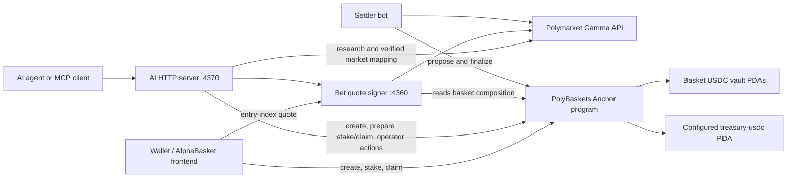

# AlphaBasket

AlphaBasket is a Solana-native prediction-basket protocol. It lets a creator
combine active Polymarket outcomes into a weighted basket, lets users stake
USDC against a signed entry index, settles the basket after every underlying
market resolves, and pays each position from a basket-specific escrow vault.

The repository also contains a quote signer, an automated settler, and a
SliceFund-derived AI/MCP backend. The AI service can research a thesis, map it
to verified Polymarket markets, normalize weights to 10,000 basis points, and
create or interact with the same on-chain baskets as any other client. It does
not add or replace frontend UI.

Configured fresh devnet program target:
`5mzLoAijdzAQV5D7QXe6TTGZ9TkWQanygfnb5VPPxFSm`.

## Architecture



| Component | Location | Responsibility |
| --- | --- | --- |
| React frontend | `src/` | Wallet connection, basket builder, staking, portfolio, settlement and claim UX |
| Solana escrow | `solana-escrow/` | Anchor program, USDC custody, limits, fees, settlement and payouts |
| Quote signer | `bet-quote-service/` | Reads basket composition and live prices, then signs short-lived Ed25519 entry-index quotes |
| Settler | `settler-bot/` | Polls Polymarket, proposes resolved indexes, waits 12 minutes and finalizes |
| AI/MCP server | `ai-server/` | Thesis research, market verification, weight mapping and on-chain agent tools |

### On-chain accounts

- `Config` PDA, seeds `["config"]`: admin, oracle authority, quote signer,
  accepted USDC mint, canonical treasury token account and pause state.
- `treasury-usdc` PDA, seeds `["treasury-usdc"]`: created once by
  `initialize`; receives protocol fees and swept surplus. Its token authority
  is the config admin.
- `Basket` PDA, seeds `["basket", basket_id]`: composition, status, indexes,
  aggregate deposits and claim counters.
- Basket vault PDA, seeds `["vault", basket_id]`: legacy SPL Token account
  holding position principal and house liquidity.
- `Position` PDA, seeds `["position", basket, owner]`: one wallet's cumulative
  deposit, net principal, entry index, quote nonce and claim state.

Basket status progresses `Active -> Proposed -> Settled`. Sweeping surplus does
not change the status.

### Program instructions

| Instruction | Who may call | Purpose |
| --- | --- | --- |
| `initialize` | First signer only, once | Creates Config and treasury USDC PDA |
| `set_authorities` | Admin | Rotates oracle and/or quote signer |
| `set_paused` | Admin | Blocks stake and claim while paused |
| `create_basket` | Any signer | Stores a valid weighted Polymarket basket and creates its vault |
| `stake` | User | Verifies a signed quote, charges the deposit fee and credits a position |
| `fund_basket` | Any signer | Adds house liquidity without consuming deposit caps |
| `propose_settlement` | Oracle authority | Proposes the resolved basket index |
| `finalize_settlement` | Any signer | Finalizes after the 12-minute challenge window |
| `claim` | Position owner | Pays the settled position and routes the withdrawal fee |
| `sweep_surplus` | Admin | Moves remaining vault USDC after every position has claimed |

## Economics and limits

- Deposit fee: 2% of every gross user deposit, sent directly to the configured
  treasury. The remaining 98% becomes position principal.
- Withdrawal fee: 2% of the gross settled payout, sent to the same treasury.
- Gross payout: `net principal × settlement index / entry index`.
- Per-wallet cap: 500 gross USDC per basket, cumulatively.
- Per-basket cap: 10,000 gross USDC across all users.
- `fund_basket` liquidity is separate and does not consume either user cap.
- Fees round up to the nearest USDC base unit. Index and payout division rounds
  down.
- `sweep_surplus` is available only after settlement and after all recorded
  positions claim. It transfers the exact remaining vault balance without
  changing basket status or accounting.

The program accepts a six-decimal legacy SPL Token mint. Token-2022 mints are
intentionally rejected.

## Prerequisites

- Node.js 20 or newer and npm
- Rust and Cargo
- Solana CLI 2.3.x
- Anchor CLI 0.32.1
- A Solana wallet funded with devnet SOL
- A six-decimal devnet USDC mint and token balances for end-to-end testing

Check the toolchain:

```bash
node --version
npm --version
rustc --version
solana --version
anchor --version
```

## Install

Install each independently versioned package:

```bash
npm install
npm install --prefix ai-server
npm install --prefix bet-quote-service
npm install --prefix settler-bot
npm install --prefix solana-escrow
```

## Environment setup

The root examples document all variables. Keep real private keys out of Git.

```bash
cp .env.example .env
cp .env.example ai-server/.env
cp .env.example bet-quote-service/.env
cp .env.example settler-bot/.env
cp .env.secrets.example .env.secrets
```

Copy only the secrets needed by a service into its untracked `.env`, or inject
them through your process manager:

- `BET_QUOTE_SIGNER_KEYPAIR` or `BET_QUOTE_SIGNER_KEYPAIR_FILE`
- `SETTLER_KEYPAIR` or `SETTLER_KEYPAIR_FILE`
- `AI_OPERATOR_KEYPAIR` or `AI_OPERATOR_KEYPAIR_FILE`
- `AI_WRITE_API_KEY` for state-changing AI HTTP routes
- `GEMINI_API_KEY` for AI-ranked thesis research

The quote signer key must match `Config.quote_signer`. The settler key must
match `Config.oracle_authority`; do not reuse the same key for both roles.

For local frontend staking, set:

```dotenv
VITE_QUOTE_API_URL=http://127.0.0.1:4360
```

There is intentionally no `VITE_AI_API_URL`: the SliceFund integration is a
backend/MCP integration and does not alter the completed AlphaBasket UI.
`VITE_TREASURY_ADDRESS` is legacy UI metadata; the program always resolves and
validates the treasury token account from on-chain Config.

## Run locally

Run services in separate terminals. Start the quote signer before any flow
that creates a stake.

### 1. Quote signer

```bash
npm --prefix bet-quote-service run dev
```

Health check:

```bash
curl http://127.0.0.1:4360/health
```

### 2. AI HTTP service

```bash
npm run dev:ai
```

Health check:

```bash
curl http://127.0.0.1:4370/api/health
```

The detailed HTTP routes and MCP tools are documented in
[ai-server/README.md](ai-server/README.md).

### 3. Settler bot

```bash
npm --prefix settler-bot run dev
```

The bot polls immediately and then uses `SETTLER_BOT_POLL_INTERVAL_MS`. It
proposes only when every underlying market is resolved and finalizes only after
the on-chain 12-minute window.

### 4. Frontend

```bash
npm run dev
```

Open `http://localhost:8080`.

### MCP server

The MCP transport is stdio and runs separately from the HTTP server:

```bash
npm run mcp:ai
```

Example client configuration:

```json
{
  "mcpServers": {
    "alphabasket": {
      "command": "npm",
      "args": [
        "--prefix",
        "/absolute/path/to/AlphaBasket/ai-server",
        "run",
        "mcp"
      ],
      "env": {
        "GEMINI_API_KEY": "...",
        "AI_OPERATOR_KEYPAIR_FILE": "/absolute/path/to/operator.json",
        "AI_QUOTE_API_URL": "http://127.0.0.1:4360"
      }
    }
  }
}
```

### Docker Compose

Build and run only the Solana services from the larger compose file:

```bash
docker compose --env-file .env --env-file .env.secrets up --build bet-quote-service ai-server settler-bot
```

Stop them with:

```bash
docker compose down
```

## Build and test

### Everything

```bash
npm run build
npm run build:ai
npm --prefix bet-quote-service run build
npm --prefix settler-bot run build
```

### Frontend

```bash
npm run lint
npm run build
npm run preview
```

### AI server

```bash
npm run test:ai
npm run build:ai
npm --prefix ai-server start
```

### Anchor program

```bash
cd solana-escrow
cargo fmt --check
anchor build
npm test
```

`npm test` runs the Bankrun suite without requiring a local validator. It
covers the happy path, forged and malformed quotes, settlement authorization,
the challenge window, vault underfunding, both deposit caps, fee routing and
admin-only surplus sweeping.

Useful contract maintenance commands:

```bash
anchor keys list
anchor clean
anchor build
solana program show <PROGRAM_ID> --url devnet
solana program show --buffers --url devnet
```

## Deploy the Anchor program to devnet

### Fresh deployment

Use a fresh program ID when account layouts are incompatible with an existing
deployment. Never overwrite or delete an existing program keypair.

```bash
cd solana-escrow
solana config set --url devnet
solana-keygen new --no-bip39-passphrase --outfile target/deploy/polybaskets_escrow-keypair.json
anchor keys sync
anchor build
```

Confirm that `anchor keys list`, `declare_id!` in
`programs/polybaskets-escrow/src/lib.rs`, and the
`[programs.devnet]` entry in `Anchor.toml` all show the same address.

Deploy with explicit growth headroom. The fee payer temporarily needs enough
SOL for both the upload buffer and ProgramData rent:

```bash
solana program deploy \
  --url devnet \
  --keypair ~/.config/solana/id.json \
  --upgrade-authority ~/.config/solana/id.json \
  --program-id target/deploy/polybaskets_escrow-keypair.json \
  --max-len 600000 \
  target/deploy/polybaskets_escrow.so
```

Do not generate a new program keypair when upgrading an already deployed
compatible program. Use its existing program ID/keypair and upgrade authority.

### Synchronize generated IDLs

After every successful build that changes the interface:

```bash
cp target/idl/polybaskets_escrow.json ../src/lib/solana/idl/polybaskets_escrow.json
cp target/types/polybaskets_escrow.ts ../src/lib/solana/idl/polybaskets_escrow.ts
cp target/idl/polybaskets_escrow.json ../bet-quote-service/src/idl/polybaskets_escrow.json
cp target/idl/polybaskets_escrow.json ../settler-bot/src/idl/polybaskets_escrow.json
```

Rebuild every consumer after copying the IDL.

### Initialize a fresh deployment

Initialization creates Config and the canonical treasury token-account PDA.
The first successful caller becomes admin, so initialize immediately after
deployment from the intended governance wallet.

```bash
export ANCHOR_PROVIDER_URL=https://api.devnet.solana.com
export ANCHOR_WALLET=~/.config/solana/id.json
export USDC_MINT=Gh9ZwEmdLJ8DscKNTkTqPbNwLNNBjuSzaG9Vp2KGtKJr
export ORACLE_AUTHORITY=<SETTLER_PUBLIC_KEY>
export QUOTE_SIGNER=<QUOTE_SIGNER_PUBLIC_KEY>
npm run initialize
```

The command aborts if Config already exists and prints the Config PDA,
treasury USDC PDA and transaction signature on success.

### Verify the deployment

```bash
solana program show <PROGRAM_ID> --url devnet
anchor verify --provider.cluster devnet <PROGRAM_ID>
```

Then rebuild the services and exercise at least one complete devnet flow:
create basket, stake, resolve/propose, wait 12 minutes, finalize, claim and
sweep any remaining surplus.

### Upgrade compatibility warning

The current `Config`, `Basket`, and `Position` layouts are larger than the
legacy devnet layouts. Upgrading the legacy program in place without explicit
reallocation/migration instructions would leave old accounts unreadable. This
version therefore targets a fresh deployment.

For future upgrades:

1. Compare every persistent account layout and discriminator.
2. Add and test migration/reallocation instructions before deploying any
   incompatible layout.
3. Run `anchor build` and the full Bankrun suite.
4. Back up the program keypair and upgrade-authority key securely.
5. Deploy, verify the on-chain program authority, and run a devnet smoke test.

## Admin operations

Sweep a fully claimed, settled basket:

```bash
cd solana-escrow
export ANCHOR_PROVIDER_URL=https://api.devnet.solana.com
export ANCHOR_WALLET=~/.config/solana/id.json
npm run sweep-surplus -- <basket-id>
```

The on-chain instruction—not the script—enforces the configured admin,
treasury account, mint, settled status and complete claim count.
