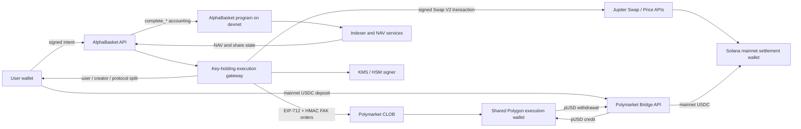

# AlphaBasket

AlphaBasket is a real-position basket protocol with share accounting on
Solana. All three asset classes execute Solana-natively:

- **Phoenix** for perpetual futures.
- **Jupiter** for spot crypto tokens and tokenized stocks.
- **Jupiter Predict** for Polymarket prediction markets, served on Solana
  through Jupiter's Prediction API (`PREDICTION_VENUE=jupiter_predict`).

The current architecture deliberately separates accounting from capital:

- The AlphaBasket program runs on **Solana devnet** during internal testing.
- User USDC deposits and withdrawal payouts use **Solana mainnet-beta**.
- Prediction, spot and perp trading all execute from the backend-controlled
  **Solana mainnet settlement wallet**.
- The original **Polymarket-on-Polygon** adapter (CLOB, bridge, pUSD) remains
  compiled and selectable with `PREDICTION_VENUE=polymarket`; nothing was
  deleted, it is simply dark by default.
- The Solana program records baskets, shares, fees, lifecycle state and
  immutable settlement receipts. It does **not** custody USDC or pUSD.

Configured devnet program ID:
`5mzLoAijdzAQV5D7QXe6TTGZ9TkWQanygfnb5VPPxFSm`.

## Current architecture

The diagram and the two flows below describe the **Polymarket venue**
(`PREDICTION_VENUE=polymarket`). With the default `jupiter_predict` venue the
Bridge, CLOB and Polygon nodes disappear: prediction orders are Solana
transactions signed by the gateway and settled in USDC at the settlement
wallet, as described in "Prediction venue: Jupiter Predict".



### Deposit flow

1. The API creates a short-lived deposit quote and the user signs the exact
   intent.
2. The user submits one Solana-mainnet transaction containing:
   - prediction allocation to the Polymarket bridge address;
   - spot allocation to the mainnet settlement wallet; and
   - the 0.5% deposit fee to the protocol destination.
3. The backend verifies both finalized mainnet token-account deltas.
4. The Bridge API converts prediction allocation to pUSD in the assigned
   Polygon execution wallet.
5. The worker submits prediction FAK buys and Jupiter spot swaps. Partial fills
   are accepted; unspent pUSD and USDC remain attributed to the basket.
6. The backend reloads a fresh off-chain NAV and submits `complete_deposit` to
   the Solana-devnet program.
7. The program verifies the user intent, backend authority, execution
   attestation, limits and accounting math before minting internal shares.

### Withdrawal flow

1. The user signs a withdrawal intent for a specific share amount and minimum
   output.
2. The backend liquidates the basket pro rata using prediction FAK sells and
   Jupiter spot-to-USDC swaps, including redeemed idle pUSD and USDC.
3. Only realized pUSD is transferred through the Bridge API to the configured
   Solana-mainnet settlement wallet.
4. The backend verifies the finalized mainnet USDC receipt.
5. The execution gateway atomically distributes mainnet USDC to the user,
   creator and protocol.
6. Only after those effects are verified does the backend submit
   `complete_withdrawal` to the Solana-devnet program.

The same split applies to protocol management-share redemption: capital moves
on mainnet/Polygon while the accounting completion runs on devnet.

## Prediction venue: Jupiter Predict

With `PREDICTION_VENUE=jupiter_predict` the prediction leg is Solana-native
end to end:

- Deposits fund every leg (prediction, spot, fee) with one Solana mainnet USDC
  transaction; prediction and spot both land on `SOLANA_SETTLEMENT_RECEIVER`,
  and the workflow verifies the summed delta per destination. No bridge, no
  pUSD, no Polygon wallet.
- Buys and sells run through `POST /v1/predict/order` on the execution
  gateway, which pre-checks the venue quote against the runner's worst price,
  builds the transaction via Jupiter's Prediction API, validates it against
  `JUPITER_PREDICT_PROGRAM_IDS` before the settlement key signs, journals it,
  broadcasts, requires finality plus a venue `filled` status, and verifies the
  USDC leg against the finalized transaction's token deltas.
- Withdrawal splits claim the finalized Predict sale transactions themselves
  as capital sources, exactly as Jupiter swap receipts are claimed.
- Idle prediction cash is idle USDC (`idle_pusd_units` stays zero); a basket
  holding legacy pUSD must be withdrawn through the Polymarket venue.
- On-chain composition identity is unchanged (Polymarket `conditionId` and
  `ctfTokenId`). The `predict_market_links` table maps a CTF token id to the
  Jupiter market and side; links are proven by a market probe or catalog scan
  and can be seeded by an operator for markets the scan cannot correlate.
- NAV marks and composer metrics read Jupiter Predict quotes through the same
  market-data port the CLOB served.

The Prediction API is in beta. Two shapes are pinned by tests and verified at
runtime rather than assumed: sells reuse `POST /orders` with `isBuy=false`
carrying the contract amount, and buy contract quantities come from the
venue's `contractsMicro` quote (cash legs are always on-chain-verified). A
shape change fails loudly before anything is signed.

## Share accounting and fees

```text
Share price = current basket NAV / total shares outstanding
Shares minted = actual net deposit value / current share price
```

One share equals one US dollar only for the basket's first-ever deposit. Future
deposits and withdrawals use the current off-chain NAV and on-chain share
supply.

Current fee model:

| Fee | Recipient | Rule |
| --- | --- | --- |
| Deposit | Protocol | 0.5% |
| Management/AUM | Protocol | 0.35% per 30 days, accrued proportionally to exact elapsed seconds through share dilution |
| Early withdrawal | Protocol | 2% before 60 days |
| Mature withdrawal | Protocol | 1% at or after 60 days |
| Performance | Creator | 0–20%, default 10%, charged only on redeemed-share profit |

Management fees do not sell Polymarket positions. The program mints protocol
shares, diluting the existing supply. A scheduled keeper accrues active baskets,
and every financial/lifecycle instruction provides a lazy-accrual fallback.

Performance fees follow redeemed-share high-water/cost-basis accounting so
burned shares cannot be charged twice. Multiple deposits use weighted-average
cost basis and holding time.

Composition constraints:

- Prediction-only or spot-only basket: 3,000 bps maximum per item.
- Mixed Polymarket/Jupiter basket: 2,000 bps maximum per item.
- Composition weights must total 10,000 bps.

## On-chain program

Location: `solana-escrow/`

The program stores four primary account types:

- `Config`: authorities, protocol destinations, limits and pause state.
- `Basket`: signed composition, lifecycle, share supply and fee state.
- `Position`: user shares, weighted cost basis, holding time and reserved
  extension space.
- `SettlementReceipt`: immutable replay protection for completed external
  executions.

Important instructions:

| Instruction | Purpose |
| --- | --- |
| `initialize` | Initialize protocol configuration and signer roles |
| `create_basket` | Verify the Composer Ed25519 authorization and create a basket |
| `complete_deposit` | Verify the signed user intent and credit shares after external execution |
| `complete_withdrawal` | Burn shares and record the verified mainnet payout/fee split |
| `accrue_management_fee` | Mint exact-time-weighted protocol management shares |
| `complete_protocol_fee_withdrawal` | Record redemption of protocol-owned shares |
| `begin_reconstitution` / `complete_reconstitution` | Pause, execute and commit a signed new composition |
| `begin_resolution` / `record_final_settlement` | Resolve and finalize non-perpetual baskets |
| `publish_perp_eligibility_list` | Publish the Composer-screened Phoenix perpetual market list |
| `onboard_trader_account` | One-time registration of a Phoenix trader account for an execution wallet |
| `complete_phoenix_trade` | Record a vault-delta-verified Phoenix fill and update the composition item |
| `attest_perp_event` | Record an autonomous Phoenix action (ADL, risk-engine cancellation) |
| `set_authorities` / `set_limits` / `set_paused` | Admin security controls |

### Perpetual futures (Phoenix)

A basket may hold Phoenix perpetuals through `PositionKind::Perp`. Three rules
shape the design:

- **Isolated margin only.** Every perpetual item names a Phoenix subaccount
  greater than zero, and no two items may share one. Subaccount 0 is Phoenix's
  cross-margin account, where a loss on one position can consume the collateral
  backing another — which would make a basket share meaningless.
- **A perpetual basket is never mixed** with spot or prediction markets.
  Blending levered and unlevered positions makes the basket's NAV
  undecomposable.
- **Nothing recorded is a quote.** `complete_phoenix_trade` takes figures the
  backend read back from real post-execution Phoenix state. The program
  validates and records; it computes no NAV, no fees and no PnL, and it never
  CPIs into Phoenix.

`entry_mark_price` and `margin_posted` are deliberately **excluded from
`canonical_composition_bytes`**. Settlement rewrites both in place as fills land,
so hashing them would make a basket's `composition_hash` stop matching its
composition after the very first trade. What the hash covers is exactly what the
Composer approved and the program never rewrites: market, direction, leverage,
subaccount and weight.

Because `MAX_SINGLE_SOURCE_WEIGHT_BPS` caps any item at 3000 bps, a fully
perpetual basket has at least four positions.

Basket composition is not supplied directly by an arbitrary creator. The
Composer service computes markets, outcomes and weights off-chain, signs the
canonical composition, and the program verifies that Ed25519 signature plus all
structural constraints. Raw Polymarket depth and volume are not stored
on-chain.

## Backend

Location: `backend/`

| Module | Responsibility |
| --- | --- |
| `accounting` | Integer-only TypeScript parity with the Rust financial math |
| `contract` | Canonical IDL, PDAs, intent/composition encoders and instruction builders |
| `composer` | Deterministic filtering, weighting and signed basket composition |
| `server` | Quote, intent, funding, operation-status and basket APIs |
| `execution` | Durable operation state machine, allocation and attestations |
| `phoenix` | Phoenix perpetual units, sizing, market selection and post-execution verification |
| `predict` | Jupiter Predict client, market links/resolution, market data and Solana-native prediction execution |
| `deposits` / `withdrawals` | Hybrid bridge, FAK/Jupiter execution and `complete_*` workflows |
| `gateway` | CLOB/Jupiter signing, Polygon transfers and Solana-mainnet fee distribution |
| `jupiter` | Verified token admission, Swap V2 execution and Price V3 marks |
| `indexer` / `nav` | Finalized devnet projections and immutable off-chain NAV snapshots |
| `lifecycle` | Management-fee keeper, reconstitution, resolution and final settlement |
| `ledger` | Append-only double-entry virtual portfolio attribution |
| `wallets` | Sticky, shard-ready basket-to-execution-wallet allocation |
| `reconciliation` | Cross-system checks, dashboard data and alert outbox |
| `resilience` | Provider retry policies and deterministic fault injection |

PostgreSQL is authoritative for backend workflow state and virtual portfolio
attribution. Finalized Solana accounts are authoritative for share accounting.
Polymarket and Solana-mainnet spot balances and fills are independently
reconciled against both.

### Financial API

- `POST /v1/quotes/deposit`
- `POST /v1/quotes/withdrawal`
- `POST /v1/intents/deposit`
- `POST /v1/intents/withdrawal`
- `POST /v1/operations/:id/funding`
- `GET /v1/operations/:id`
- `POST /v1/baskets`

Financial mutations require idempotency keys. Composer and operations routes use
separate bearer authentication.

## Hybrid environment

Copy `backend/.env.example` to `backend/.env` and configure at least:

```text
DEPLOYMENT_MODE=hybrid_devnet

PREDICTION_VENUE=jupiter_predict
JUPITER_PREDICT_PROGRAM_IDS=<Predict program ids the settlement key may sign>

ACCOUNTING_SOLANA_CLUSTER=devnet
ACCOUNTING_SOLANA_RPC_URL=<Solana devnet RPC>

CAPITAL_SOLANA_CLUSTER=mainnet-beta
CAPITAL_SOLANA_RPC_URL=<Solana mainnet RPC>
CAPITAL_SOLANA_USDC_MINT=EPjFWdd5AufqSSqeM2qN1xzybapC8G4wEGGkZwyTDt1v

CAPITAL_MODE=live_bridge
POLYGON_CHAIN_ID=137
POLYGON_RPC_URL=<Polygon mainnet RPC>

POLYMARKET_CLOB_API_KEY=<CLOB API key>
POLYMARKET_CLOB_API_SECRET=<CLOB API secret>
POLYMARKET_CLOB_API_PASSPHRASE=<CLOB passphrase>
POLYMARKET_EXECUTION_WALLET=<Polygon execution wallet>
POLYMARKET_PUSD_TOKEN_ADDRESS=<Polygon pUSD token>
SOLANA_SETTLEMENT_RECEIVER=<Solana mainnet settlement owner>

JUPITER_SPOT_ENABLED=true
JUPITER_API_KEY=<Jupiter API key>
JUPITER_TOKENS_URL=https://api.jup.ag/tokens/v2
JUPITER_SWAP_URL=https://api.jup.ag/swap/v2
JUPITER_PRICE_URL=https://api.jup.ag/price/v3

EXECUTION_GATEWAY_URL=<internal gateway URL>
EXECUTION_GATEWAY_TOKEN=<random 32+ character secret>
REMOTE_SIGNER_URL=<remote signing service>
REMOTE_SIGNER_TOKEN=<random 32+ character secret>
```

The backend rejects hybrid startup unless:

- accounting is labelled devnet;
- capital is labelled mainnet-beta;
- capital mode is `live_bridge`;
- Polymarket uses Polygon chain ID 137; and
- accounting and capital use different RPC URLs.

Public-network workers also verify each RPC's genesis hash, preventing an
endpoint labelled as devnet from silently pointing to mainnet or vice versa.

## Running the backend

Requirements:

- Node.js 22 or newer.
- PostgreSQL 16 or compatible.
- Temporal.
- Solana CLI and Anchor 0.32.1 for program development.
- The included loopback development signer for internal testing, or an external
  KMS/HSM signer endpoint for production.

Install and migrate:

```bash
npm install
npm --prefix backend install
npm run migrate:backend
```

Start production-style processes in this order:

```bash
npm run start:indexer:backend
npm run start:nav:backend
npm run start:remote-signer:backend
npm run start:execution-gateway:backend
npm run start:execution-dispatcher:backend
npm run start:execution:backend
npm run start:lifecycle:backend
npm run start:backend
```

Development equivalents use the `dev:*:backend` scripts in the root
`package.json`.

The API listens on `127.0.0.1:3001`, the execution gateway on
`127.0.0.1:3002`, and the internal-testing remote signer on
`127.0.0.1:3003` by default. Generate its ignored mode-`0600` keyring first:

```bash
mkdir -p backend/.remote-signer
npm run signer:keyring:generate:backend -- \
  --output /absolute/path/to/AlphaBasket/backend/.remote-signer/keyring.json
```

The command prints only public identities to place in
`POLYMARKET_EXECUTION_WALLET`, `SOLANA_SETTLEMENT_RECEIVER`,
`COMPOSER_SIGNER_PUBLIC_KEY`, and `BACKEND_SIGNER_PUBLIC_KEY`. Full setup and
the program-key mapping are documented in
[`backend/README.md`](backend/README.md#remote-signer-for-internal-testing).

## Verification

UI, end to end against the real API (no chain needed):

```bash
npm install                                  # installs playwright
npx playwright install chromium              # once
docker compose up -d postgres                # or any Postgres the backend can reach
npm run migrate:backend
npm run dev:backend                          # API on 127.0.0.1:3001
npm run dev                                  # UI on localhost:8080
npm run test:ui                              # seeds demo rows, drives the UI, screenshots
```

`scripts/ui-e2e/run.mjs` seeds three demo indexes and two positions
(`scripts/ui-e2e/seed-demo.sql`, all tagged `source_slot = 999000000`),
injects a Wallet Standard wallet that signs with a deterministic key, and
walks every screen: list, filters, search, the index panel, deposit and
withdrawal quotes with exact figures, signing and submitting both intents,
the builder's validation, the wallet menu, disconnected and API-down states,
a missing index, the 404, and a 390px viewport. It proves the read plane,
the quote math shown to the user, and that the browser's intent bytes are
what the backend verifies. It does not prove execution: a backend with no
registered execution wallet refuses the signed intent, and the test asserts
the UI recovers from that. `PSQL` and `APP_URL` override the defaults.

For a real cycle, run the full hybrid stack (`start:*` scripts below), let
the indexer project real baskets, and deposit from the UI with a wallet
holding mainnet USDC; the panel then polls the operation to `completed` and
your position appears at `/`.

Backend:

```bash
npm --prefix backend run typecheck
npm --prefix backend test
npm --prefix backend run idl:check
npm --prefix backend audit --omit=dev
```

Contract:

```bash
cd solana-escrow
anchor build
anchor test
```

`anchor test` requires anchor-cli 0.32.1. Under a newer CLI (1.x) it silently
delegates to `surfpool` and runs nothing while still exiting 0; run the suite
directly instead — it is bankrun-based and needs no validator:

```bash
cd solana-escrow
NODE_OPTIONS='--import tsx' npx mocha -t 1000000 'tests/**/*.ts'
```

Check the configured devnet deployment:

```bash
solana program show \
  5mzLoAijdzAQV5D7QXe6TTGZ9TkWQanygfnb5VPPxFSm \
  --url devnet
```

## Security model

- No private key belongs in the API server, worker environment or database.
- Role-separated Composer, accounting-completion, Polygon-order and
  Solana-settlement keys are accessed through a policy-enforced remote signer.
- CLOB and Jupiter API credentials remain inside the authenticated execution
  gateway.
- Exact signed transaction/order payloads are journaled before broadcast.
- Jupiter-reported fills are checked against finalized Solana-mainnet token
  deltas before they enter the ledger.
- Jupiter signing accepts exactly one settlement signer and an explicit
  top-level program allowlist rooted at the configured aggregator.
- Every external effect has a deterministic idempotency key and immutable
  accounting receipt.
- Finalized bridge and Jupiter source receipts are atomically claimable by only
  one payout split, preventing replay across operations.
- Shared execution wallets permit only one capital-changing operation at a
  time; scaling uses sticky wallet shards.
- Hybrid mode moves real mainnet capital and therefore uses the same allowlists,
  caps and reconciliation controls as a production canary.

## Current integration status

The contract, backend domain logic, API routes, workers, execution gateway,
management-fee automation, reconciliation and security tests are implemented.

Before a live hybrid test, operators must still:

1. connect real devnet/mainnet/Polygon RPCs;
2. generate the loopback development keyring for internal testing, or provision
   the production KMS/HSM signer roles;
3. configure CLOB credentials and required Polymarket token approvals;
4. configure a Jupiter API key, official mainnet USDC mint and vetted spot
   mints;
5. register/fund the execution and settlement wallets;
6. apply migrations and start PostgreSQL/Temporal/workers;
7. **redeploy the program to devnet.** As of 2026-09-19 the account at
   `5mzLoAijdzAQV5D7QXe6TTGZ9TkWQanygfnb5VPPxFSm` holds a different, roughly
   125-day-old program: it exports `FundBasket` and `SweepSurplus`, which no
   longer exist, and exports none of the v2 instructions (`initialize`,
   `complete_deposit`, `complete_phoenix_trade`, `publish_perp_eligibility_list`
   and the rest). It owns **zero** accounts and the current `config` PDA
   (`GEnKDYuWthH6P6Hzm2gmBEhMMfHGg4wgwPzcFNketWAY`) is absent, so nothing on
   devnet can be read or completed until it is upgraded. The upgrade authority
   is `FWTH3qY4r3Aa18jFY4yEMzYyMj2icVQ8u8UbGmWmuAc`. Verify with:

   ```bash
   solana program dump 5mzLoAijdzAQV5D7QXe6TTGZ9TkWQanygfnb5VPPxFSm /tmp/devnet.so --url devnet
   strings -a /tmp/devnet.so | grep -oE 'Instruction: [A-Za-z]+' | sort -u
   ```

8. execute low-value prediction-only, spot-only and mixed deposit/withdrawal
   canaries.

The React frontend (`src/`) is one page: every index, your positions and the
builder live at `/`, with an index or the builder opening as a panel over the
list (`/index/:address`, `/create`). It reads the public read plane, quotes
deposits and withdrawals, signs the intent with the connected wallet, and for
deposits builds the single Solana-mainnet USDC transaction from the backend's
funding list on the capital RPC (`VITE_CAPITAL_SOLANA_RPC_URL`). Perpetual
indexes are shown but not investable until the Phoenix execution path opens;
the backend refuses them with `perp_basket_unsupported`. Publishing a
composition still runs through the Composer, so the builder hands the operator
a validated composition rather than posting it from the browser.

Production Composer TODO:

1. Wire authoritative Gamma market sourcing into the backend.
2. Connect a trusted classifier for thematic relevance and outcome clarity.
3. Fetch and verify current price, spread, depth and volume directly from the
   CLOB before composing a basket.
4. Restrict caller-prepared candidate data to internal-testing environments;
   production must not sign caller-supplied liquidity or classification claims.
5. Add a full Gamma → classifier → CLOB → filtering/weighting → signed
   composition → devnet/mainnet `create_basket` integration test.

Detailed backend operations are documented in
[`backend/README.md`](backend/README.md) and
[`backend/docs/phase-5-6-runbook.md`](backend/docs/phase-5-6-runbook.md).

Legacy quote-signer, settler and escrow-oriented directories may remain in the
repository for reference, but they are not the active AlphaBasket execution
path described above.
